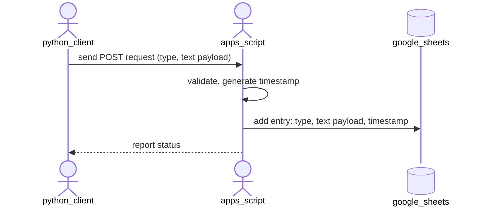

# Architecture Overview

## System diagram


## Data flow

1. **Human or LLM** calls `sheetpost <type> <text>` or `echo '...' | sheetpost --json`
2. **Python client** reads config from environment variables, constructs JSON payload
3. **Python client** sends HTTPS POST to webhook URL with JSON body
4. **Apps Script** validates request, checks token, appends row to Google Sheet
5. **Apps Script** returns JSON response (success or error)
6. **Python client** parses response, prints result to human or returns JSON to LLM

---

## Interface contract

### HTTP endpoint

```
POST <SHEETPOST_URL>
Content-Type: application/json
```

### Request payload

```json
{
  "token": "<webhook-token>",
  "type": "<identifier>",
  "text": "<note content>",
  "id": "<optional-uuid>"
}
```

**Constraints:**
- `token`: required, string, stored in Script Properties
- `type`: required, string, 1-200 characters. 
  Is used to identify the kind of entry (is an idea, metric, reminder, ...)
- `text`: required, string, 1-1000 characters (upper boundary is TBD, but 1k seems reasonable)
- `id`: optional, string, 1-100 characters (caller-provided, no auto-generation): 
  if clients care about the entries to be idempotent, they shall set this.

### Response payload — success

```json
{
  "ok": true
}
```

**HTTP 200**

### Response payload — error

```json
{
  "ok": false,
  "error": "<short error message>"
}
```

**HTTP 400 or 500** (validation errors = 400, server errors = 500)

**Error examples:**
```
"missing token"
"invalid token"
"missing text"
"text too long"
"webhook unavailable"
```

---

## Configuration

### Google Apps Script (server-side)

Script Properties (set once, stored in Google):

```
WEBHOOK_TOKEN       = <random 256-bit token>
SPREADSHEET_NAME    = "Notes"
SHEET_NAME          = "Notes"
TIMEZONE            = "Europe/Bucharest"
```

### Python client (client-side)

Environment variables (set by user):

```
SHEETPOST_URL   = "https://script.google.com/macros/d/.../usercontent"
SHEETPOST_TOKEN = <same as WEBHOOK_TOKEN above>
```

---

## Row format in Google Sheet

Each POST request appends exactly one row:

| Timestamp (UTC)        | Text              | type  |
|------------------------|-------------------|-------|
| 2025-08-18T14:32:45Z   | Remember to call  | phone |
| 2025-08-18T14:33:12Z   | Backup completed  | cron  |

- **Timestamp**: ISO 8601 UTC (server-generated)
- **Text**: exact text from request (preserved, no truncation)
- **Type**: exact type from request (preserved)

---

## Retry behavior

### Python client

- Retries **only** on network errors (timeout, connection refused, DNS failure)
- Up to 1 retry (2 attempts total)
- 1-second backoff between retries

### Apps Script

- Retries **only** on transient API errors (quota exhausted, temporary unavailability)
- Up to 2 retries (3 attempts total)
- Exponential backoff (1s, 3s)

---

## Idempotency (optional)

If caller provides `id` field in request:

1. Apps Script checks if `id` already exists in `_metadata` sheet
2. If yes, return success without creating duplicate row
3. If no, create row and store `id` in `_metadata`

If `id` is omitted, idempotency is not guaranteed (duplicates possible on retry).

---

## Deployment

1. **Setup Apps Script**:
   - create or use existing Google Sheet
   - deploy Apps Script as Web App
   - configure Script Properties
   - obtain webhook URL

2. **Setup Python client**:
   - clone repo, place `bin/sheetpost` in PATH
   - set `SHEETPOST_URL` and `SHEETPOST_TOKEN` environment variables

3. **Test**:
   - run `sheetpost test_type "test"`
   - verify row appears in Sheet
