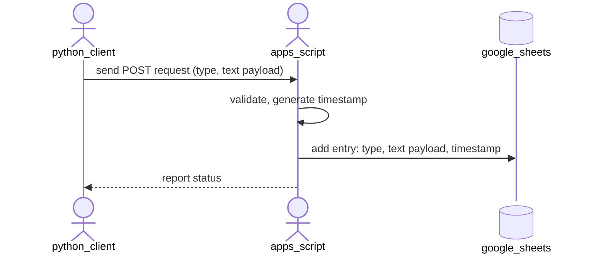

# Architecture Overview

## System Diagram



## Data Flow

1. Client triggers CLI: `sheetpost <type> <text>` or `echo '...' | sheetpost --json`.
2. Python client reads configuration, constructs JSON payload, and sends HTTPS POST.
3. Apps Script validates request, verifies token, and appends row to Google Sheet.
4. Apps Script returns JSON response.
5. Python client processes response and prints status.

## Interface Contract

### HTTP Endpoint

```
POST <SHEETPOST_URL>
Content-Type: application/json
```

### Request Payload

```json
{
  "token": "<webhook-token>",
  "type": "<identifier>",
  "text": "<note content>",
  "id": "<optional-uuid>"
}
```

### Constraints

* `token`: Required string matching stored `WEBHOOK_TOKEN`.
* `type`: Required string, 1–200 characters. Identifies entry category.
* `text`: Required string, 1–1000 characters.
* `id`: Optional string, 1–100 characters. Used for client-side idempotency.

### Response Payload: Success

```json
{
  "ok": true
}
```

HTTP Status: 200

### Response Payload: Error

```json
{
  "ok": false,
  "error": "<short error message>"
}
```

HTTP Status: 400 or 500

### Error Messages

* `"missing token"`
* `"invalid token"`
* `"missing text"`
* `"text too long"`
* `"webhook unavailable"`

## Configuration

### Google Apps Script (Script Properties)

```
WEBHOOK_TOKEN       = <random 256-bit token>
SPREADSHEET_NAME    = "Notes"
SHEET_NAME          = "Notes"
TIMEZONE            = "Europe/Bucharest"
```

### Python Client (Environment Variables)

```
SHEETPOST_URL   = "https://script.google.com/macros/d/.../usercontent"
SHEETPOST_TOKEN = <Matches WEBHOOK_TOKEN>
```

## Sheet Row Format

Each POST request appends one row:

| Timestamp (UTC)        | Text              | type  |
|------------------------|-------------------|-------|
| 2025-08-18T14:32:45Z   | Remember to call  | phone |
| 2025-08-18T14:33:12Z   | Backup completed  | cron  |

* **Timestamp**: ISO 8601 UTC (server-generated).
* **Text**: Exact text from request.
* **Type**: Exact type from request.

## Retry Behavior

### Python Client

* Retries only on network errors (timeout, connection refused, DNS failure).
* Maximum of 1 retry (2 attempts total).
* 1-second backoff.

### Apps Script

* Retries only on transient API errors (quota, temporary unavailability).
* Maximum of 2 retries (3 attempts total).
* Exponential backoff (1s, 3s).

## Idempotency

* Optional `id` field enables deduplication.
* Apps Script checks if `id` exists in `_metadata` sheet.
* If present, returns success without duplicating the row.
* If absent, appends row and records `id`.

## Deployment

1. **Deploy Apps Script**:
   * Create Google Sheet.
   * Deploy Apps Script project as Web App.
   * Configure Script Properties and obtain Web App URL.

2. **Configure Python Client**:
   * Add `bin/sheetpost` to PATH.
   * Set `SHEETPOST_URL` and `SHEETPOST_TOKEN` environment variables.

3. **Verify**:
   * Run `sheetpost test_type "test"`.
   * Confirm the row appends to the Sheet.
