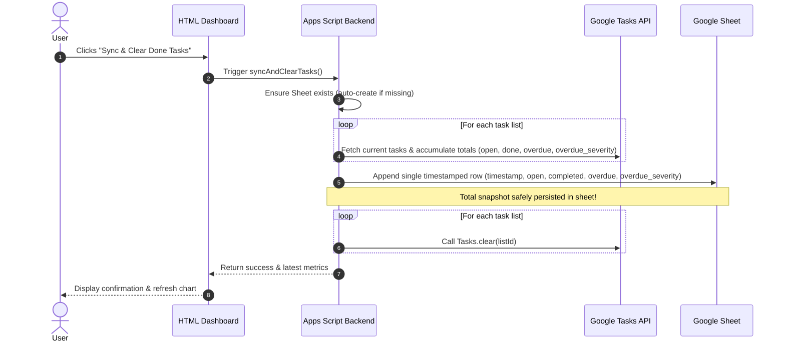
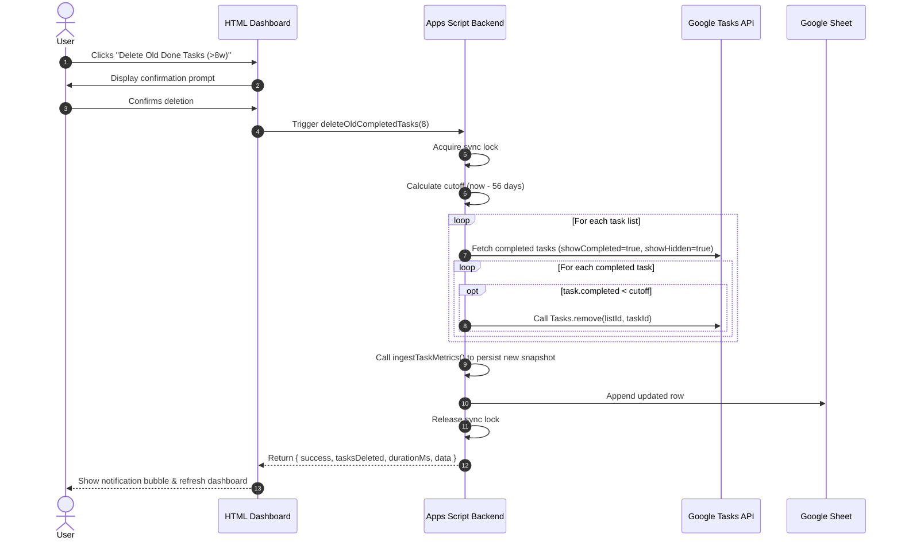
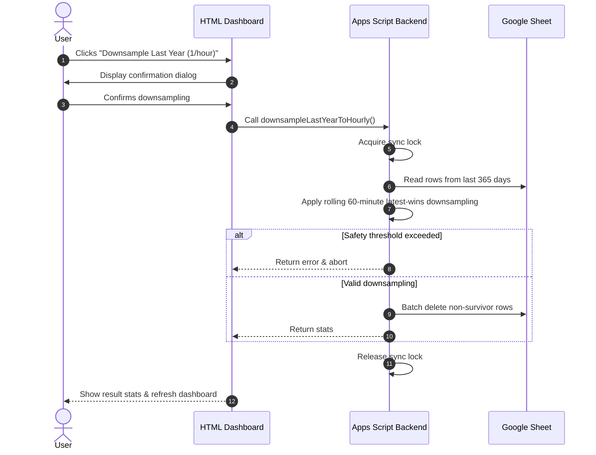
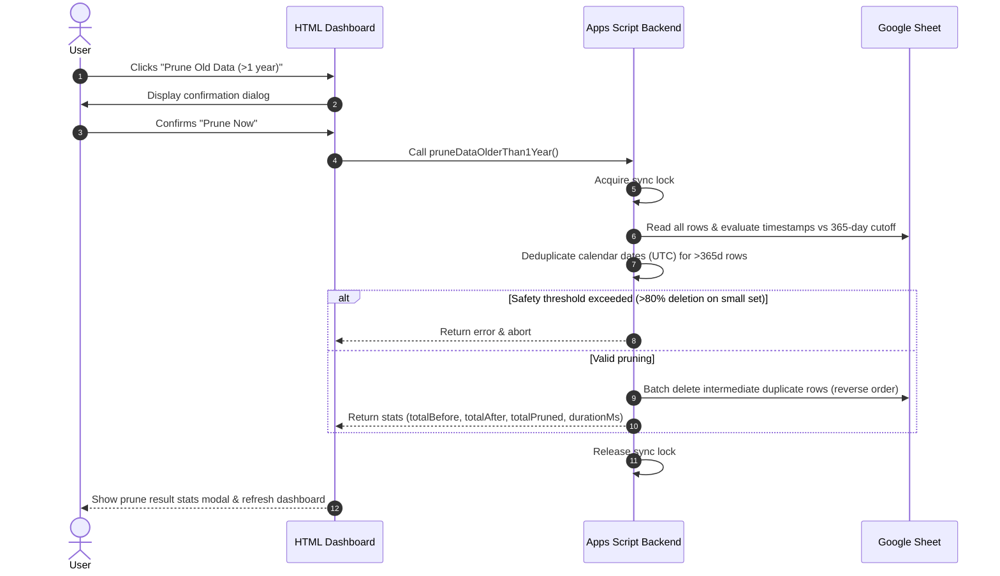

# Requirements for Google task dashboard

## Purpose

Should ingest google tasks on a regular basis (e.g. every 2 hours). Store the
metrics in a Google sheet as the storage backend. Provide a website where the
metrics can be viewed as time series.

The metrics are always tracked as an aggregate sum across all task lists (no
per-list breakdown).

The user shall be able to see a trend of tasks that are open, done, overdue, and
the compounding burden of overdue tasks via an "overdue severity" score that applies
a sublinear $\sqrt{\text{days}}$ scaling to mitigate extreme outlier distortion.

## Components

* apps script: gets triggered by a timed trigger (e.g. every 3 hours). it reads
  all task lists, aggregates the metrics into a single total, and updates a
  specific google sheet with a single timestamped row. Automatically creates and
  initializes the Google Sheet if it does not yet exist. Automatically installs the
  3-hour background trigger on first launch if `AUTO_SYNC_ENABLED` property is unset
* google sheet: serves as a storage, no special logic attached
* HTML component: serves an HTML site with a dashboard that reads data from the
  Google sheet and plots the aggregated time series with interactive toggles,
  dual-axis charts, and date range filters

## Auth model

Since its for personal use, very simple: apps script gets access to tasks. The
HTML app can be viewed by my personal account (device needs to be logged in to
google account). The deployment address is random, this adds to security, but we
rely on the Google auth for access.

## Technical requirements

### apps script

* Iterate across all available Google Task lists via `Tasks.Tasklists.list()`
* Fetch task items from each list and calculate aggregate totals across all lists:
  * `open`: Count of incomplete tasks (`status != "completed"`). In the stacked charts, tasks are decomposed into non-overlapping mutually exclusive series: **On-Time Open** (`open - overdue`) and **Overdue** (`overdue`) so that stacking represents the true volume without double-counting.
  * `completed`: Count of completed tasks (`status == "completed"`)
  * `overdue`: Count of open tasks where `due < snapshot_timestamp`
  * `overdue_severity`: Sublinear overdue debt score calculated as $\sum \sqrt{\max(0, (\text{now} - \text{due}) / 1\,\text{day})}$ across all late open tasks. Fractional days are retained. Applying the square root dampens the impact of extreme zombie-task outliers while still penalizing aging tasks progressively.
  * Open tasks due more than 6 months in the future are excluded from the `open` and `overdue` metrics. Tasks without a due date remain included.
* **Auto-creation & Initialization of Sheet:**
  * Checks Script Properties for an existing `SPREADSHEET_ID`
  * If missing or invalid, automatically creates a new Google Spreadsheet (e.g. `"Google Tasks Metrics Storage"`), initializes the header row (`timestamp`, `open`, `completed`, `overdue`, `overdue_severity`), and saves the spreadsheet ID to Script Properties
* **Auto-Sync Trigger Default State:**
  * Checks Script Properties for `AUTO_SYNC_ENABLED`. If unset (first run), initializes the property to `'true'` and installs the recurring 3-hour trigger (`everyHours(3)`).
  * Exposes `setTriggerEnabled(bool)` which updates the Script Property and adds/removes the Apps Script project trigger accordingly.
* Append a single timestamped row of aggregate metrics to the Google Sheet per run
* Scheduled time-driven trigger for automated collection
* Implement `doGet()` to serve the dashboard and supply sheet data
* Expose an on-demand sync endpoint / function callable from frontend (`syncNow()`)
* Expose `getDashboardData()` to read existing rows directly from the Google Sheet without calling Tasks API
* Expose a `syncAndClearTasks()` endpoint: persists aggregate snapshot first, then iterates all lists and clears completed tasks via Google Tasks API (`Tasks.Tasks.clear()`)
* **Age-based Completed Task Cleanup (`deleteTasksCompletedOlderThan(cutoffWeeks = 8)`):**
  * Selectively deletes tasks that were marked completed more than 8 weeks (56 days) ago across all task lists.
  * Preserves recently completed tasks (< 8 weeks) in Google Tasks so that recent completion history and throughput velocity remain visible.
  * Iterates each task list, queries completed tasks (`status == 'completed'`), inspects the `task.completed` timestamp against `now - 8 weeks`, and permanently removes eligible tasks via `Tasks.Tasks.remove(taskListId, taskId)`.
  * Ingests a new metrics snapshot to persist updated counts after deletion.
  * Returns execution statistics: `{ success: boolean, tasksDeleted: number, durationMs: number, error?: string }`.
* **Manual Daily Pruning (`pruneDataOlderThan1Year()`):**
  * Allows manual downsampling of historical data older than 1 year (365 days) to 1 snapshot per calendar day (UTC)
  * Removes intermediate (e.g. 3-hour) data points in reverse row order while preserving recent data (< 1 year) intact
  * Includes a safety threshold (aborts if > 80% total rows would be pruned) and concurrency locking
  * Returns detailed execution statistics: `totalBefore`, `totalAfter`, `totalPruned`, `percentageRemoved`, `durationMs`

### sheet

* Dedicated spreadsheet serving as append-only time series log
* Predefined column headers: `timestamp`, `open`, `completed`, `overdue`, `overdue_severity` (single aggregated row per snapshot run)
* Auto-created and maintained by Apps Script

### HTML component

* Single-page dashboard served via Apps Script HTML Service
* Responsive layout with top summary KPI cards (`Open Tasks`, `Completed`, `Overdue Count`, `Overdue Severity`)
* The KPI section shall also provide a **Backlog ETA** card when an estimate
  is computable. It uses completion and addition rates over the selected range,
  shows the estimated days to zero, and is hidden when the backlog is zero or
  the completion rate does not exceed the addition rate.
* **Chart Visualizations:**
  * **Graph Downsampling:** Long date ranges are downsampled for rendering,
    while underlying data and KPI values remain unchanged. Short ranges retain
    sufficient visual detail.
  * **Rolling Average / Trend Line:** An optional dotted, reduced-opacity
    rolling average overlays each visible series. The window size adapts to
    the selected range and series visibility applies to both raw and average
    lines. Severity remains an independent secondary-axis average.
  * **Rolling Average / Trend Line:** An optional dotted, reduced-opacity
    rolling average overlays each visible series. The window size adapts to
    the selected range and series visibility applies to both raw and average
    lines. For stacked series, the average uses the same cumulative stacking
    logic as the corresponding raw series; severity remains an independent
    secondary-axis average.
  * **Stacked Area/Line + Dual-Axis Overlay Chart (Primary Chart):**
    * *Stacked Volume (Left Y-Axis):* Stacked lines with area shading decomposing tasks into non-overlapping mutually exclusive layers: **On-Time Open** (`open - overdue`), **Overdue** (`overdue`), and **Completed** (`completed`). Stacking preserves total volume without double-counting overdue tasks.
    * *Severity Line Overlay (Right Y-Axis):* `Overdue Severity` (score based on $\sqrt{\text{days}}$) overlaid on the second vertical axis with prominent unstacked line and distinct points.
* **Interactive Chart Features:**
  * **Series / Element Toggling:** Interactive toggle buttons/checkboxes allowing the user to show/hide specific metric series (e.g., toggle "On-Time Open", "Overdue", "Completed", "Overdue Severity") dynamically
  * **Date Range Filtering:** Quick-select range filters (e.g., 3 Days, 7 Days, 14 Days, 30 Days, All Time) to dynamically filter rows without backend roundtrips
* **Action Controls & Housekeeping (with descriptive tooltips):**
  * **View Sheet**: Direct link opening the backing Google Spreadsheet in Google Drive
  * **Fetch Data From Sheet**: Re-reads historical snapshots from the Google Sheet without calling the Google Tasks API (retrieves background sync updates)
  * **Ingest From Tasks**: Queries the Google Tasks API immediately across all task lists, appends a new snapshot row to the Google Sheet, and refreshes the charts
  * **Launch Google Tasks**: Direct link opening the Google Tasks view in Google Calendar in a separate browser tab
  * **Danger Zone Section**:
    * **Auto-Sync Toggle**: Control for the automated 3-hour background sync trigger (enabled by default via Script Properties)
    * **Delete Old Done Tasks (>8w)**: Selectively deletes tasks completed more than 8 weeks ago from Google Tasks, keeping recent completions intact
    * **Purge Completed Tasks**: Triggers ingestion first, persists snapshot to sheet, and automatically clears *all* completed tasks across all lists from Google Tasks
    * **Downsample Last Year (1/hour)**: Permanently reduces snapshots from the last 365 days to at most 1 entry per rolling 60-minute window, keeping the latest snapshot in each window
    * **Prune Old Data (>1 year)**: Danger Zone action providing on-demand pruning of >1 year records down to 1 entry/day with confirmation dialog and detailed statistical feedback modal
    * **Configurable Sheet-Data Auto-Fetch**: Optional background fetch of existing sheet data at 15, 30, or 60-minute intervals, paused while the browser tab is hidden. When the tab regains focus after the interval elapsed, a fetch is performed immediately.
* Lightweight responsive styling for desktop and mobile. On small screens, the KPI summary cards are hidden and the header action buttons use a consistent responsive layout.

* **Dashboard behavior and responsive requirements:**
  * On viewports narrower than 768 px, the header action buttons shall use a
    responsive layout that stacks or distributes them evenly while remaining
    usable on small screens.
  * On viewports narrower than 768 px, the KPI summary cards shall be hidden.
  * KPI cards shall use reduced vertical padding while preserving their labels,
    values, and supporting text.
  * Header action buttons shall use consistent sizing, minimum height,
    alignment, spacing, and text wrapping behavior.
  * The Danger Zone shall be collapsed by default when the dashboard is opened.
    Expanding and collapsing it shall rotate the disclosure arrow smoothly by
    90 degrees: right-pointing (`→`) when collapsed and down-pointing (`↓`)
    when expanded.
  * The Danger Zone summary shall prevent text selection while it is being
    clicked or toggled, so the interaction shall not show a text-selection
    cursor or blinking insertion cursor.
  * The Danger Zone actions shall be ordered from highest to lowest destructive
    impact.
  * The dashboard shall display completion throughput velocity for 24-hour,
    3-day, and 7-day windows. Each velocity shall be calculated using the
    actual elapsed time between the snapshots used for that window rather than
    assuming a fixed sampling interval. Positive completion increments shall
    be accumulated while drops caused by purges or deletions are ignored.
  * The date-range controls shall provide a dedicated 3-day (`3D`) quick
    filter in addition to 7-day, 14-day, 30-day, and All ranges.
  * The overdue severity calculation shall retain fractional overdue days.
    For example, an overdue age of 2.3 days shall contribute `sqrt(2.3)` to
    the severity score rather than being truncated to 2 days before applying
    the square root.
  * The dashboard shall continuously refresh the relative age of the latest
    snapshot without making backend requests solely for this display. The
    relative age shall update at least every 10 seconds and shall be refreshed
    immediately whenever new dashboard data is fetched.
  * The dashboard shall display separate relative ages for the latest task
    snapshot and the most recent fetch from the Google Sheet.
  * Sheet-fetch and snapshot ages shall support higher-resolution elapsed-time
    formatting: minute resolution below 1 hour, decimal-hour resolution from
    1 hour to 24 hours, and day resolution from 24 hours onward.
  * Sheet-data auto-fetch shall be configurable at 15, 30, or 60 minutes and
    enabled by default. It shall pause while the tab is hidden and, when the
    tab regains focus, fetch immediately if the configured interval elapsed
    while hidden. Background fetches shall never call the Google Tasks API.
  * The dashboard shall display an estimated backlog completion time when the
    current open count is greater than zero and the historical completion rate
    exceeds the addition rate. The estimate shall use the selected date range
    and shall otherwise be hidden or display "Cannot estimate".
  * Overdue Severity shall be displayed with exactly one decimal place in the
    KPI card and chart while backend values remain unchanged.
  * The header shall provide a direct link to the Google Tasks view in Google
    Calendar, opening it in a separate browser tab.

## Workflows

### Sync & Clear Done Tasks Sequence

### Delete Tasks Completed > 8 Weeks Ago Sequence

### Downsample Last Year Sequence

### Manual Prune Old Data Sequence

## Open questions

* question: what happens if we delete tasks, do we remove them from the metrics
  as well? is there some kind of uuid mechanism that we can use in our storage
  to find unique tasks?
  * answer: No historical metric rows should be modified. The sheet acts as an
    immutable point-in-time snapshot log. If tasks are deleted, the next
    snapshot simply records the updated aggregate counts. To avoid losing
    completed task history when cleaning up, the user can use the "Sync & Clear
    Done Tasks" feature, which safely persists the completion metrics before
    clearing done tasks across all lists. Google Tasks provides unique immutable
    `task.id`s, but individual IDs do not need to be stored in the sheet for
    aggregate trend metrics. `completed` represents the number of completed tasks
    currently retained in Google Tasks at snapshot time; deleting completed
    tasks can therefore cause a downward discontinuity in the metric, while
    historical snapshots remain unchanged.

## Next steps and features

The following features remain planned and are not yet requirements for the
current implementation:

### Planned in implementation plan

- **90-degree Danger Zone arrow rotation** — The Danger Zone disclosure arrow
  shall point right (`→`) while collapsed and down (`↓`) while expanded,
  using a 90-degree rotation transition rather than a 180-degree rotation.
  - Effort: S
  - Files: Styles.html, Index.html

  