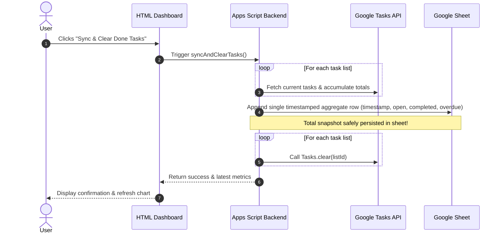

# Requirements for Google task dashboard

## Purpose

Should ingest google tasks on a regular basis (e.g. every 2 hours). Store the
metrics in a Google sheet as the storage backend. Provide a website where the
metrics can be viewed as time series.

The metrics are always tracked as an aggregate sum across all task lists (no
per-list breakdown).

The user shall be able to see a trend of tasks that are open, done, overdue, ...

## Components

* apps script: gets triggered by a timed trigger (e.g. every 3 hours). it reads
  all task lists, aggregates the metrics into a single total, and updates a
  specific google sheet with a single timestamped row
* google sheet: serves as a storage, no special logic attached
* HTML component: serves an HTML site with a dashboard that reads data from the
  Google sheet and plots the aggregated time series

## Auth model

Since its for personal use, very simple: apps script gets access to tasks. The
HTML app can be viewed by my personal account (device needs to be logged in to
google account). The deployment address is random, this adds to security, but we
rely on the Google auth for access.

## Technical requirements

### apps script

* Iterate across all available Google Task lists via `Tasks.Tasklists.list()`
* Fetch task items from each list and calculate aggregate totals across all lists (sum of open, completed, overdue counts)
* Append a single timestamped row of aggregate metrics to the Google Sheet per run
* Scheduled time-driven trigger for automated collection
* Implement `doGet()` to serve the dashboard and supply sheet data
* Expose an on-demand sync endpoint / function callable from frontend
* Expose a `syncAndClearTasks()` endpoint: persists aggregate snapshot first, then iterates all lists and clears completed tasks via Google Tasks API (`Tasks.Tasks.clear()`)

### sheet

* Dedicated spreadsheet serving as append-only time series log
* Predefined column headers (timestamp, open, completed, overdue) — strictly single aggregated row per snapshot run
* Spreadsheet ID configured in Script Properties

### HTML component

* Single-page dashboard served via Apps Script HTML Service
* Time series charts (e.g. Chart.js / Google Charts) showing aggregate trends over time
* Basic interactive filters (date range selector: 7 days, 30 days, all time)
* Action buttons:
  * **Sync Now**: Triggers immediate data ingestion and chart refresh
  * **Sync & Clear Done Tasks**: Triggers ingestion first, persists snapshot to sheet, and automatically clears completed tasks across all lists from Google Tasks
* Lightweight responsive layout

## Workflows

### Sync & Clear Done Tasks Sequence

## Open questions

* question: what happens if we delete tasks, do we remove them from the metrics
  as well? is there some kind of uuid mechanism that we can use in our storage
  to find unique tasks?
  * answer: No historical metric rows should be modified. The sheet acts as an
    immutable point-in-time snapshot log. If tasks are deleted, the next
    snapshot simply records the updated aggregate counts. To avoid losing
    completed task history when cleaning up, the user can use the "Sync & Clear
    Done Tasks" feature, which safely persists the completion metrics before
    clearing done tasks across all lists. Google Tasks provides unique immutable
    `task.id`s, but individual IDs do not need to be stored in the sheet for
    aggregate trend metrics.
