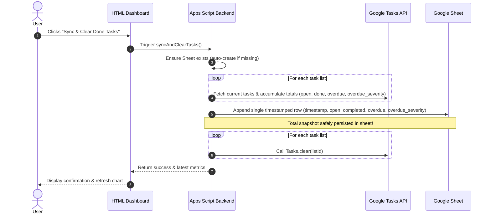
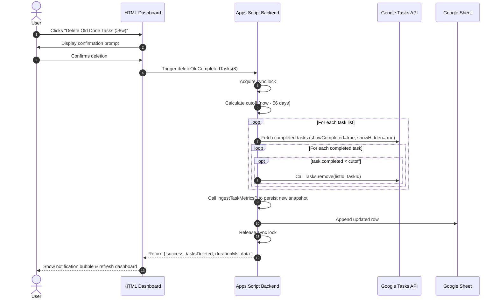
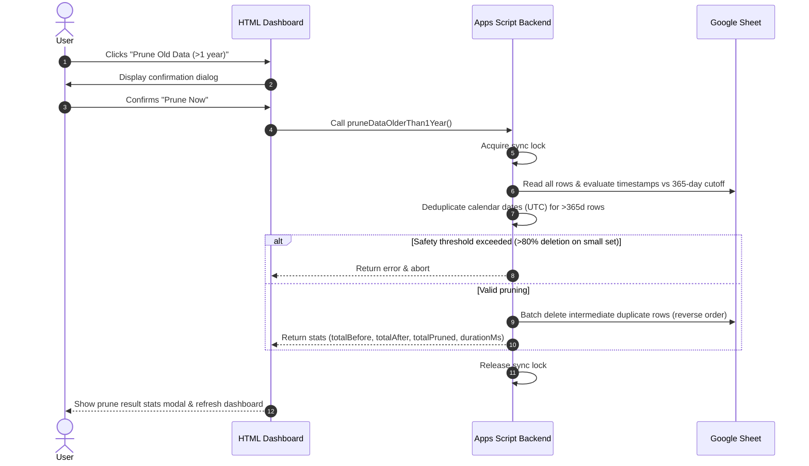

# Requirements for Google task dashboard

## Purpose

Should ingest google tasks on a regular basis (e.g. every 2 hours). Store the
metrics in a Google sheet as the storage backend. Provide a website where the
metrics can be viewed as time series.

The metrics are always tracked as an aggregate sum across all task lists (no
per-list breakdown).

The user shall be able to see a trend of tasks that are open, done, overdue, and
the compounding burden of overdue tasks via an "overdue severity" score that applies
a sublinear $\sqrt{\text{days}}$ scaling to mitigate extreme outlier distortion.

## Components

* apps script: gets triggered by a timed trigger (e.g. every 3 hours). it reads
  all task lists, aggregates the metrics into a single total, and updates a
  specific google sheet with a single timestamped row. Automatically creates and
  initializes the Google Sheet if it does not yet exist. Automatically installs the
  3-hour background trigger on first launch if `AUTO_SYNC_ENABLED` property is unset
* google sheet: serves as a storage, no special logic attached
* HTML component: serves an HTML site with a dashboard that reads data from the
  Google sheet and plots the aggregated time series with interactive toggles,
  dual-axis charts, and date range filters

## Auth model

Since its for personal use, very simple: apps script gets access to tasks. The
HTML app can be viewed by my personal account (device needs to be logged in to
google account). The deployment address is random, this adds to security, but we
rely on the Google auth for access.

## Technical requirements

### apps script

* Iterate across all available Google Task lists via `Tasks.Tasklists.list()`
* Fetch task items from each list and calculate aggregate totals across all lists:
  * `open`: Count of incomplete tasks (`status != "completed"`). In the stacked charts, tasks are decomposed into non-overlapping mutually exclusive series: **On-Time Open** (`open - overdue`) and **Overdue** (`overdue`) so that stacking represents the true volume without double-counting.
  * `completed`: Count of completed tasks (`status == "completed"`)
  * `overdue`: Count of open tasks where `due < snapshot_timestamp`
  * `overdue_severity`: Sublinear overdue debt score calculated as $\sum \sqrt{\max(0, (\text{now} - \text{due}) / 1\,\text{day})}$ across all late open tasks. Fractional days are retained. Applying the square root dampens the impact of extreme zombie-task outliers while still penalizing aging tasks progressively.
* **Auto-creation & Initialization of Sheet:**
  * Checks Script Properties for an existing `SPREADSHEET_ID`
  * If missing or invalid, automatically creates a new Google Spreadsheet (e.g. `"Google Tasks Metrics Storage"`), initializes the header row (`timestamp`, `open`, `completed`, `overdue`, `overdue_severity`), and saves the spreadsheet ID to Script Properties
* **Auto-Sync Trigger Default State:**
  * Checks Script Properties for `AUTO_SYNC_ENABLED`. If unset (first run), initializes the property to `'true'` and installs the recurring 3-hour trigger (`everyHours(3)`).
  * Exposes `setTriggerEnabled(bool)` which updates the Script Property and adds/removes the Apps Script project trigger accordingly.
* Append a single timestamped row of aggregate metrics to the Google Sheet per run
* Scheduled time-driven trigger for automated collection
* Implement `doGet()` to serve the dashboard and supply sheet data
* Expose an on-demand sync endpoint / function callable from frontend (`syncNow()`)
* Expose `getDashboardData()` to read existing rows directly from the Google Sheet without calling Tasks API
* Expose a `syncAndClearTasks()` endpoint: persists aggregate snapshot first, then iterates all lists and clears completed tasks via Google Tasks API (`Tasks.Tasks.clear()`)
* **Age-based Completed Task Cleanup (`deleteTasksCompletedOlderThan(cutoffWeeks = 8)`):**
  * Selectively deletes tasks that were marked completed more than 8 weeks (56 days) ago across all task lists.
  * Preserves recently completed tasks (< 8 weeks) in Google Tasks so that recent completion history and throughput velocity remain visible.
  * Iterates each task list, queries completed tasks (`status == 'completed'`), inspects the `task.completed` timestamp against `now - 8 weeks`, and permanently removes eligible tasks via `Tasks.Tasks.remove(taskListId, taskId)`.
  * Ingests a new metrics snapshot to persist updated counts after deletion.
  * Returns execution statistics: `{ success: boolean, tasksDeleted: number, durationMs: number, error?: string }`.
* **Manual Daily Pruning (`pruneDataOlderThan1Year()`):**
  * Allows manual downsampling of historical data older than 1 year (365 days) to 1 snapshot per calendar day (UTC)
  * Removes intermediate (e.g. 3-hour) data points in reverse row order while preserving recent data (< 1 year) intact
  * Includes a safety threshold (aborts if > 80% total rows would be pruned) and concurrency locking
  * Returns detailed execution statistics: `totalBefore`, `totalAfter`, `totalPruned`, `percentageRemoved`, `durationMs`

### sheet

* Dedicated spreadsheet serving as append-only time series log
* Predefined column headers: `timestamp`, `open`, `completed`, `overdue`, `overdue_severity` (single aggregated row per snapshot run)
* Auto-created and maintained by Apps Script

### HTML component

* Single-page dashboard served via Apps Script HTML Service
* Responsive layout with top summary KPI cards (`Open Tasks`, `Completed`, `Overdue Count`, `Overdue Severity`)
* **Chart Visualizations:**
  * **Stacked Area/Line + Dual-Axis Overlay Chart (Primary Chart):**
    * *Stacked Volume (Left Y-Axis):* Stacked lines with area shading decomposing tasks into non-overlapping mutually exclusive layers: **On-Time Open** (`open - overdue`), **Overdue** (`overdue`), and **Completed** (`completed`). Stacking preserves total volume without double-counting overdue tasks.
    * *Severity Line Overlay (Right Y-Axis):* `Overdue Severity` (score based on $\sqrt{\text{days}}$) overlaid on the second vertical axis with prominent unstacked line and distinct points.
* **Interactive Chart Features:**
  * **Series / Element Toggling:** Interactive toggle buttons/checkboxes allowing the user to show/hide specific metric series (e.g., toggle "On-Time Open", "Overdue", "Completed", "Overdue Severity") dynamically
  * **Date Range Filtering:** Quick-select range filters (e.g., 3 Days, 7 Days, 14 Days, 30 Days, All Time) to dynamically filter rows without backend roundtrips
* **Action Controls & Housekeeping (with descriptive tooltips):**
  * **View Sheet**: Direct link opening the backing Google Spreadsheet in Google Drive
  * **Reload Data**: Re-reads historical snapshots from the Google Sheet without calling the Google Tasks API (retrieves background sync updates)
  * **Sync Now**: Queries the Google Tasks API immediately across all task lists, appends a new snapshot row to the Google Sheet, and refreshes the charts
  * **Danger Zone Section**:
    * **Auto-Sync Toggle**: Control for the automated 3-hour background sync trigger (enabled by default via Script Properties)
    * **Delete Old Done Tasks (>8w)**: Selectively deletes tasks completed more than 8 weeks ago from Google Tasks, keeping recent completions intact
    * **Purge Completed Tasks**: Triggers ingestion first, persists snapshot to sheet, and automatically clears *all* completed tasks across all lists from Google Tasks
    * **Prune Old Data (>1 year)**: Danger Zone action providing on-demand pruning of >1 year records down to 1 entry/day with confirmation dialog and detailed statistical feedback modal
* Lightweight responsive styling for desktop and mobile. On small screens, the KPI summary cards are hidden and the header action buttons use a consistent responsive layout.

* **Dashboard behavior and responsive requirements:**
  * On viewports narrower than 768 px, the header action buttons shall use a
    responsive layout that stacks or distributes them evenly while remaining
    usable on small screens.
  * On viewports narrower than 768 px, the KPI summary cards shall be hidden.
  * The Danger Zone shall be collapsed by default when the dashboard is opened.
    Expanding and collapsing it shall rotate the disclosure arrow smoothly by
    90 degrees: right-pointing (`→`) when collapsed and down-pointing (`↓`)
    when expanded.
  * The Danger Zone summary shall prevent text selection while it is being
    clicked or toggled, so the interaction shall not show a text-selection
    cursor or blinking insertion cursor.
  * The dashboard shall display completion throughput velocity for 24-hour,
    3-day, and 7-day windows. Each velocity shall be calculated using the
    actual elapsed time between the snapshots used for that window rather than
    assuming a fixed sampling interval.
  * The date-range controls shall provide a dedicated 3-day (`3D`) quick
    filter in addition to 7-day, 14-day, 30-day, and All ranges.
  * The overdue severity calculation shall retain fractional overdue days.
    For example, an overdue age of 2.3 days shall contribute `sqrt(2.3)` to
    the severity score rather than being truncated to 2 days before applying
    the square root.
  * The dashboard shall continuously refresh the relative age of the latest
    snapshot without making backend requests solely for this display. The
    relative age shall update at least every 10 seconds and shall be refreshed
    immediately whenever new dashboard data is fetched.
  * The header shall provide a direct link to the Google Tasks view in Google
    Calendar, opening it in a separate browser tab.

## Workflows

### Sync & Clear Done Tasks Sequence

### Delete Tasks Completed > 8 Weeks Ago Sequence

### Manual Prune Old Data Sequence

## Open questions

* question: what happens if we delete tasks, do we remove them from the metrics
  as well? is there some kind of uuid mechanism that we can use in our storage
  to find unique tasks?
  * answer: No historical metric rows should be modified. The sheet acts as an
    immutable point-in-time snapshot log. If tasks are deleted, the next
    snapshot simply records the updated aggregate counts. To avoid losing
    completed task history when cleaning up, the user can use the "Sync & Clear
    Done Tasks" feature, which safely persists the completion metrics before
    clearing done tasks across all lists. Google Tasks provides unique immutable
    `task.id`s, but individual IDs do not need to be stored in the sheet for
    aggregate trend metrics. `completed` represents the number of completed tasks
    currently retained in Google Tasks at snapshot time; deleting completed
    tasks can therefore cause a downward discontinuity in the metric, while
    historical snapshots remain unchanged.

## Next steps and features

The following features remain planned and are not yet requirements for the
current implementation:

### Planned in implementation plan

- **Auto-refresh toggle (30 min interval)** — Optional background polling of sheet data every 30 minutes; toggleable on dashboard (default: off)
  - Effort: M
  - Files: JavaScript.html
- **Graph downsampling / smoothing** — Automatic point reduction for large date ranges (14d+) to improve chart rendering speed and reduce visual clutter while preserving trend visibility
  - Effort: M
  - Files: JavaScript.html
- **6-month future task filter** — Exclude tasks due >6 months in future from "Open Tasks" count to avoid artificial inflation from placeholder far-future tasks; add UI note
  - Effort: S
  - Files: Code.js, JavaScript.html
- **Rolling average line (advanced)** — Optional thin overlay line showing N-point moving average for smoother trend visualization on longer timeframes
  - Effort: L
  - Status: On hold pending UX refinement (window size, series selection, toggle placement)
  - Files: JavaScript.html
- **Separate snapshot and sheet-fetch ages** — The dashboard shall display two independent timestamps/relative ages: the age of the latest task snapshot and the age of the most recent fetch of historical data from the Google Sheet. Both relative-age displays shall be updated by the same client-side timer loop and immediately after data is fetched.
  - Effort: M
  - Files: JavaScript.html, Index.html
- **Action button terminology and external-link icon** — Rename the relevant dashboard actions to `Fetch Data From Sheets`, `Ingest From Tasks`, and `Launch Google Tasks`. The external Google Tasks action shall use the 🔗 icon.
  - Effort: S
  - Files: Index.html, JavaScript.html
- **Reduced KPI card height** — Reduce the vertical space occupied by the KPI cards while preserving their labels, values, and supporting text.
  - Effort: S
  - Files: Styles.html
- **Danger Zone action ordering** — Order the Danger Zone actions from highest impact/gravity to lowest impact/gravity.
  - Effort: S
  - Files: Index.html
- **Configurable sheet-data auto-fetch** — Provide an optional dashboard toggle that automatically fetches existing metric data from the Google Sheet at a configurable interval. Auto-fetch shall be disabled while the browser tab is not in focus. The implementation shall select a safe default interval and document the resulting daily request volume. This background operation shall read from the sheet only and shall not invoke the Google Tasks API.
  - Effort: M
  - Files: JavaScript.html, Index.html
- **90-degree Danger Zone arrow rotation** — The Danger Zone disclosure arrow shall point right (`→`) while collapsed and down (`↓`) while expanded, using a 90-degree rotation transition rather than a 180-degree rotation.
  - Effort: S
  - Files: Styles.html, Index.html

### user supplied, not yet planned
- UI: Overdue Severity shall have only 1 digit after the decimal separator (in graph and also in the card, backend can be left unaffected)
- Estimated task completion: Display an estimate of the number of days from now until the open-task backlog reaches zero, calculated from the current open-task count, the completion rate, and the estimated task-addition rate over the selected historical window; explicitly present the result as an estimate.
- Consistent action-button sizing: All header action buttons shall have the same height and align their content consistently, regardless of the button label wrapping to one or more lines.
- mark in the UI "last updated x hours ago" should have a higher resolution for values larger than 1h. Example: 1.2 hours ago instead of rounding down to 1 hour. For low values under 1 hour minute resolution is enough.
  