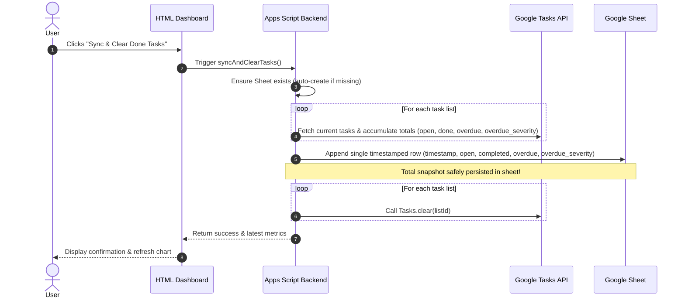
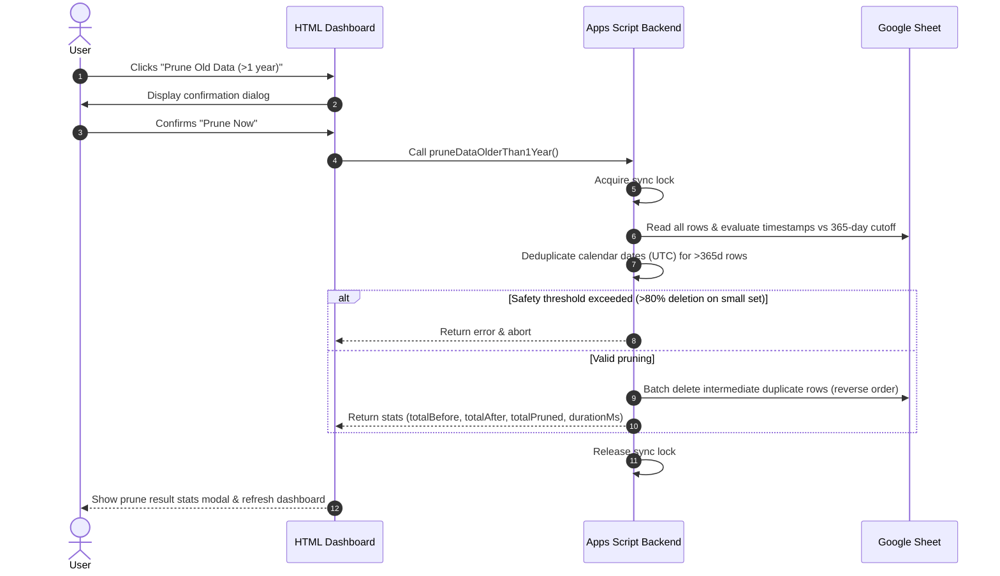

# Requirements for Google task dashboard

## Purpose

Should ingest google tasks on a regular basis (e.g. every 2 hours). Store the
metrics in a Google sheet as the storage backend. Provide a website where the
metrics can be viewed as time series.

The metrics are always tracked as an aggregate sum across all task lists (no
per-list breakdown).

The user shall be able to see a trend of tasks that are open, done, overdue, and
the compounding burden of overdue tasks via an "overdue severity" score that applies
a sublinear $\sqrt{\text{days}}$ scaling to mitigate extreme outlier distortion.

## Components

* apps script: gets triggered by a timed trigger (e.g. every 3 hours). it reads
  all task lists, aggregates the metrics into a single total, and updates a
  specific google sheet with a single timestamped row. Automatically creates and
  initializes the Google Sheet if it does not yet exist. Automatically installs the
  3-hour background trigger on first launch if `AUTO_SYNC_ENABLED` property is unset
* google sheet: serves as a storage, no special logic attached
* HTML component: serves an HTML site with a dashboard that reads data from the
  Google sheet and plots the aggregated time series with interactive toggles,
  dual-axis charts, and date range filters

## Auth model

Since its for personal use, very simple: apps script gets access to tasks. The
HTML app can be viewed by my personal account (device needs to be logged in to
google account). The deployment address is random, this adds to security, but we
rely on the Google auth for access.

## Technical requirements

### apps script

* Iterate across all available Google Task lists via `Tasks.Tasklists.list()`
* Fetch task items from each list and calculate aggregate totals across all lists:
  * `open`: Count of incomplete tasks (`status != "completed"`). In the stacked charts, tasks are decomposed into non-overlapping mutually exclusive series: **On-Time Open** (`open - overdue`) and **Overdue** (`overdue`) so that stacking represents the true volume without double-counting.
  * `completed`: Count of completed tasks (`status == "completed"`)
  * `overdue`: Count of open tasks where `due < snapshot_timestamp`
  * `overdue_severity`: Sublinear overdue debt score calculated as $\sum \sqrt{\max(0, \lfloor(\text{now} - \text{due}) / 1\,\text{day}\rfloor)}$ across all late open tasks. Applying the square root dampens the impact of extreme zombie-task outliers while still penalizing aging tasks progressively.
* **Auto-creation & Initialization of Sheet:**
  * Checks Script Properties for an existing `SPREADSHEET_ID`
  * If missing or invalid, automatically creates a new Google Spreadsheet (e.g. `"Google Tasks Metrics Storage"`), initializes the header row (`timestamp`, `open`, `completed`, `overdue`, `overdue_severity`), and saves the spreadsheet ID to Script Properties
* **Auto-Sync Trigger Default State:**
  * Checks Script Properties for `AUTO_SYNC_ENABLED`. If unset (first run), initializes the property to `'true'` and installs the recurring 3-hour trigger (`everyHours(3)`).
  * Exposes `setTriggerEnabled(bool)` which updates the Script Property and adds/removes the Apps Script project trigger accordingly.
* Append a single timestamped row of aggregate metrics to the Google Sheet per run
* Scheduled time-driven trigger for automated collection
* Implement `doGet()` to serve the dashboard and supply sheet data
* Expose an on-demand sync endpoint / function callable from frontend (`syncNow()`)
* Expose `getDashboardData()` to read existing rows directly from the Google Sheet without calling Tasks API
* Expose a `syncAndClearTasks()` endpoint: persists aggregate snapshot first, then iterates all lists and clears completed tasks via Google Tasks API (`Tasks.Tasks.clear()`)
* **Manual Daily Pruning (`pruneDataOlderThan1Year()`):**
  * Allows manual downsampling of historical data older than 1 year (365 days) to 1 snapshot per calendar day (UTC)
  * Removes intermediate (e.g. 3-hour) data points in reverse row order while preserving recent data (< 1 year) intact
  * Includes a safety threshold (aborts if > 80% total rows would be pruned) and concurrency locking
  * Returns detailed execution statistics: `totalBefore`, `totalAfter`, `totalPruned`, `percentageRemoved`, `durationMs`

### sheet

* Dedicated spreadsheet serving as append-only time series log
* Predefined column headers: `timestamp`, `open`, `completed`, `overdue`, `overdue_severity` (single aggregated row per snapshot run)
* Auto-created and maintained by Apps Script

### HTML component

* Single-page dashboard served via Apps Script HTML Service
* Responsive layout with top summary KPI cards (`Open Tasks`, `Completed`, `Overdue Count`, `Overdue Severity`)
* **Chart Visualizations:**
  * **Stacked Area/Line + Dual-Axis Overlay Chart (Primary Chart):**
    * *Stacked Volume (Left Y-Axis):* Stacked lines with area shading decomposing tasks into non-overlapping mutually exclusive layers: **On-Time Open** (`open - overdue`), **Overdue** (`overdue`), and **Completed** (`completed`). Stacking preserves total volume without double-counting overdue tasks.
    * *Severity Line Overlay (Right Y-Axis):* `Overdue Severity` (score based on $\sqrt{\text{days}}$) overlaid on the second vertical axis with prominent unstacked line and distinct points.
* **Interactive Chart Features:**
  * **Series / Element Toggling:** Interactive toggle buttons/checkboxes allowing the user to show/hide specific metric series (e.g., toggle "On-Time Open", "Overdue", "Completed", "Overdue Severity") dynamically
  * **Date Range Filtering:** Quick-select range filters (e.g., 7 Days, 14 Days, 30 Days, All Time) and custom date inputs to dynamically filter rows without backend roundtrips
* **Action Controls & Housekeeping (with descriptive tooltips):**
  * **View Sheet**: Direct link opening the backing Google Spreadsheet in Google Drive
  * **Reload Data**: Re-reads historical snapshots from the Google Sheet without calling the Google Tasks API (retrieves background sync updates)
  * **Sync Now**: Queries the Google Tasks API immediately across all task lists, appends a new snapshot row to the Google Sheet, and refreshes the charts
  * **Danger Zone Section**:
    * **Auto-Sync Toggle**: Control for the automated 3-hour background sync trigger (enabled by default via Script Properties)
    * **Purge Completed Tasks**: Triggers ingestion first, persists snapshot to sheet, and automatically clears completed tasks across all lists from Google Tasks
    * **Prune Old Data (>1 year)**: Danger Zone action providing on-demand pruning of >1 year records down to 1 entry/day with confirmation dialog and detailed statistical feedback modal
* Lightweight responsive styling for desktop and mobile

## Workflows

### Sync & Clear Done Tasks Sequence

### Manual Prune Old Data Sequence

## Open questions

* question: what happens if we delete tasks, do we remove them from the metrics
  as well? is there some kind of uuid mechanism that we can use in our storage
  to find unique tasks?
  * answer: No historical metric rows should be modified. The sheet acts as an
    immutable point-in-time snapshot log. If tasks are deleted, the next
    snapshot simply records the updated aggregate counts. To avoid losing
    completed task history when cleaning up, the user can use the "Sync & Clear
    Done Tasks" feature, which safely persists the completion metrics before
    clearing done tasks across all lists. Google Tasks provides unique immutable
    `task.id`s, but individual IDs do not need to be stored in the sheet for
    aggregate trend metrics.
