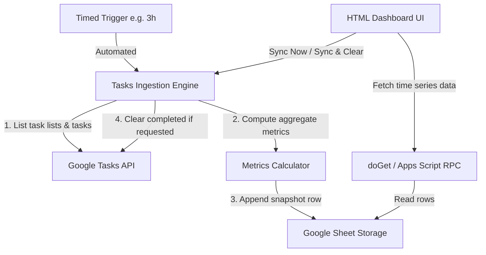

# Implementation Plan: Google Tasks Dashboard

## 1. Overview & Target Directory

* **Target Directory:** `google-task-dashboard/webhook/` (all production project files will be created and deployed here).
* **Reference Directory:** `google-task-dashboard/prototype/` (used only for reference/inspiration).



---

## 2. Configuration & Manifest (`google-task-dashboard/webhook/appsscript.json`)

Enable the Tasks Advanced Service and specify required OAuth scopes:

```json
{
  "timeZone": "UTC",
  "dependencies": {
    "enabledAdvancedServices": [
      {
        "userSymbol": "Tasks",
        "serviceId": "tasks",
        "version": "v1"
      }
    ]
  },
  "exceptionLogging": "STACKDRIVER",
  "runtimeVersion": "V8",
  "oauthScopes": [
    "https://www.googleapis.com/auth/tasks",
    "https://www.googleapis.com/auth/spreadsheets",
    "https://www.googleapis.com/auth/script.storage"
  ]
}
```

---

## 3. Backend Implementation (`google-task-dashboard/webhook/Code.js`)

### 3.1 Sheet Storage & Auto-Creation (`getOrCreateSheet`)
* **Key:** `SPREADSHEET_ID` in `PropertiesService.getScriptProperties()`.
* **Flow:**
  1. Retrieve `SPREADSHEET_ID`.
  2. If missing or `openById()` fails:
     * Create spreadsheet: `SpreadsheetApp.create("Google Tasks Metrics Storage")`.
     * Set header row `[Timestamp, Open, Completed, Overdue, Overdue Severity]`.
     * Store new ID in Script Properties.
  3. Return the active data sheet.

### 3.2 Ingestion & Metric Calculation (`ingestTaskMetrics`)
* **API Ingestion:**
  * Call `Tasks.Tasklists.list()` to fetch all user task lists.
  * For each list, paginate `Tasks.Tasks.list(listId, { showCompleted: true, showHidden: true, maxResults: 100 })`.
* **Metric Formulas:**
  * `open`: Count where `task.status === 'needsAction'`.
  * `completed`: Count where `task.status === 'completed'`.
  * `overdue`: Count where `task.status === 'needsAction'` and `task.due && new Date(task.due) < now`.
  * `overdue_severity`: For all overdue open tasks:
    $$\sum \sqrt{\max\left(0, \left\lfloor \frac{\text{now} - \text{due}}{86400000} \right\rfloor\right)}$$
* **Storage:**
  * Append `[new Date().toISOString(), open, completed, overdue, Number(overdue_severity.toFixed(2))]` to the sheet.

### 3.3 Public Endpoints & RPC Methods
* **`doGet()`**: Serves `Index.html` via `HtmlService.createTemplateFromFile('Index').evaluate()`.
* **`include(filename)`**: Helper to modularly embed `Styles.html` and `JavaScript.html`.
* **`getDashboardData()`**: Reads all rows from sheet, returns structured JSON `{ headers, rows }` for fast client rendering.
* **`syncNow()`**: Runs `ingestTaskMetrics()` and returns updated dataset.
* **`syncAndClearTasks()`**:
  1. Runs `ingestTaskMetrics()` (metrics saved).
  2. Iterates all task lists and calls `Tasks.Tasks.clear(taskListId)`.
  3. Returns updated dataset.
* **`installTrigger()`**: Utility function to register a recurring time-driven trigger (`everyHours(3)`).

---

## 4. Frontend Implementation (`google-task-dashboard/webhook/`)

### 4.1 HTML Structure (`google-task-dashboard/webhook/Index.html`)
* **Header & Controls Bar:**
  * Action buttons: `Sync Now` and `Sync & Clear Done Tasks` (with loading spinners / status indicators).
  * Date range selector pills: `7D`, `14D`, `30D`, `All`.
  * Series toggle checkboxes/pills: `Open Tasks`, `Completed`, `Overdue`, `Overdue Severity`.
* **KPI Metric Cards:** Current Open, Completed, Overdue Count, Overdue Severity.
* **Chart Panels:**
  * **Primary Chart:** Dual-Axis Time Series Combo Chart (`#mainChart`).
  * **Throughput Chart:** Completed tasks per day/period (`#completedChart`).

### 4.2 Charting & Interactivity (`google-task-dashboard/webhook/JavaScript.html`)
* **Google Charts Setup:** Load `packages: ['corechart']`.
* **Dual-Axis Combo Chart Configuration:**
  ```javascript
  const options = {
    seriesType: 'line',
    series: {
      0: { targetAxisIndex: 0, color: '#1a73e8' }, // Open Tasks
      1: { targetAxisIndex: 0, color: '#188038' }, // Completed
      2: { targetAxisIndex: 0, color: '#d93025' }, // Overdue Count
      3: { targetAxisIndex: 1, type: 'area', color: '#f2994a', fillOpacity: 0.15 } // Overdue Severity
    },
    vAxes: {
      0: { title: 'Task Count', minValue: 0 },
      1: { title: 'Overdue Severity (√days)', minValue: 0 }
    },
    hAxis: { title: 'Time' },
    interpolateNulls: true
  };
  ```
* **Client-Side Interactivity via `google.visualization.DataView`:**
  * **Series Toggle:** Use `dataView.setColumns([0, ...activeColumnIndices])` to show/hide series without re-fetching data.
  * **Date Range Filter:** Filter rows with `dataView.setRows(filteredRowIndices)` matching selected timeframe (7D, 14D, 30D, All).
* **Server Communication:**
  * `google.script.run.withSuccessHandler(renderData).getDashboardData()`
  * Button handlers to trigger `syncNow()` and `syncAndClearTasks()` with instant UI feedback.

### 4.3 Styling & Responsiveness (`google-task-dashboard/webhook/Styles.html`)
* Clean modern dashboard layout (CSS Grid / Flexbox).
* Pill buttons with active/inactive states.
* Responsive card layout for mobile and desktop screens.

---

## 5. Implementation Steps & Verification

| Step | Target File | Description |
| :--- | :--- | :--- |
| **1** | `google-task-dashboard/webhook/appsscript.json` | Configure OAuth scopes & Tasks advanced service dependency. |
| **2** | `google-task-dashboard/webhook/Code.js` | Implement auto-creation sheet logic, ingestion calculations, and trigger installer. |
| **3** | `google-task-dashboard/webhook/Code.js` | Implement `getDashboardData()`, `syncNow()`, and `syncAndClearTasks()`. |
| **4** | `google-task-dashboard/webhook/Index.html`, `google-task-dashboard/webhook/Styles.html` | Build KPI cards, buttons, filter pills, and responsive styling. |
| **5** | `google-task-dashboard/webhook/JavaScript.html` | Implement Dual-Axis Google Chart, `DataView` column/row toggles, and RPC hooks. |
| **6** | Verification | Verify sheet auto-creation, manual sync, scheduled trigger, and sync & clear workflow. |
